# Technical Plan

Defines core classes, relationships, and responsibilities. 

---

## Enums & Interfaces

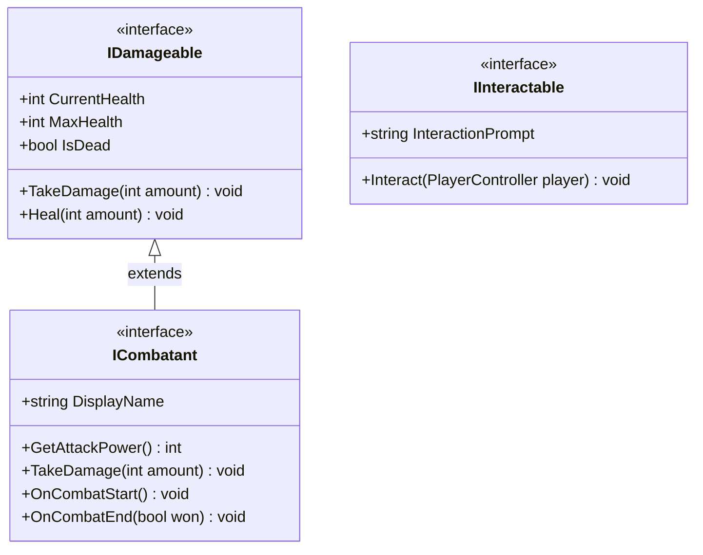

**Enums:**
```
GameState: Exploration, Combat, Puzzle, Inventory, Paused, Transition
AbilityType: Dodge, DashStrike, Block, Grapple, MeleeAttack, RangedAttack
BulletPatternType: Straight, Spread, Circle, Wave, Spiral
AttackType: Melee, Ranged, Projectile
```

---

## ScriptableObject Data Layer

All game content is defined as ScriptableObject assets. Code never changes when adding new enemies, weapons, or levels.

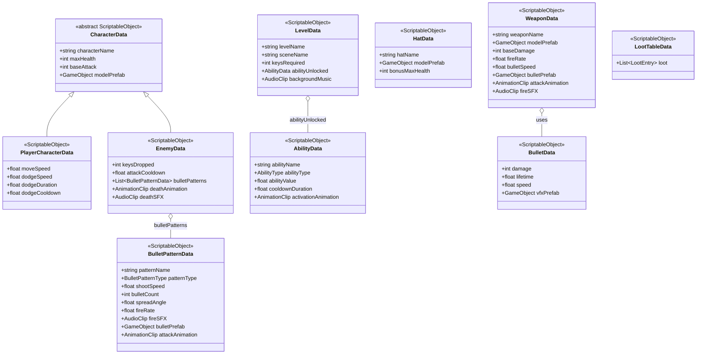

---

## Player System

Four sibling components on the Player GameObject. `PlayerController` is the hub and the others are focused helpers.

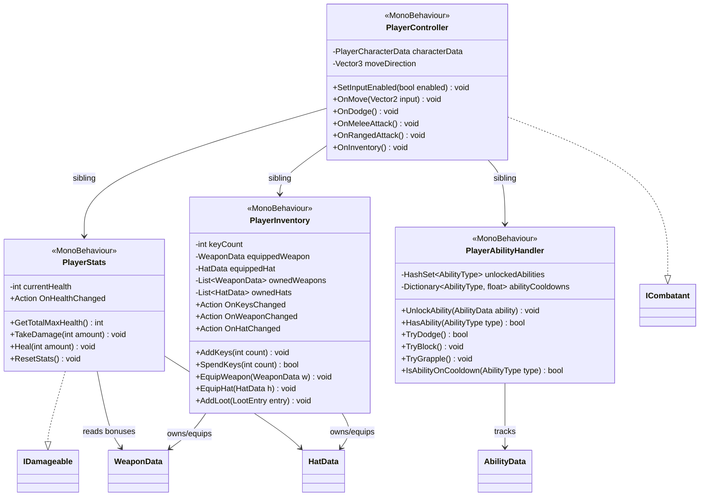

---

## Enemy System

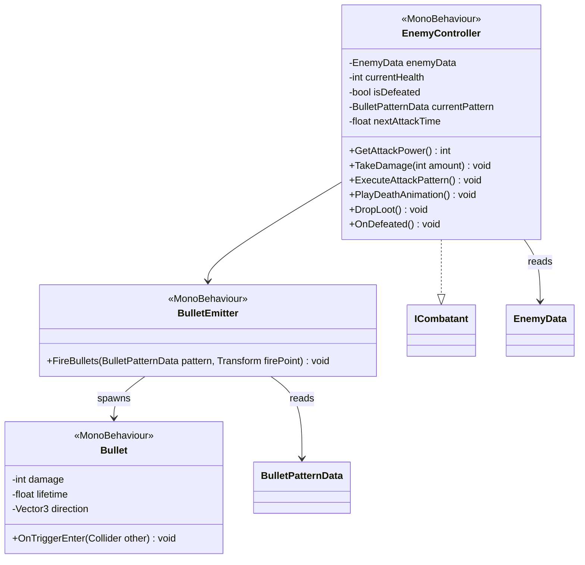

- Enemies are placed manually in level scenes and are stationary (do not chase player)
- Each enemy has a list of `BulletPatternData` assets defining their attack patterns
- Enemies fire at intervals based on `attackCooldown` and selected pattern
- On defeat: plays death animation, drops keys, plays death sound effect, disables GameObject
- Different bullet patterns (straight, spread, circle, wave, spiral) defined via SO data

---

## Combat System

Real time action combat. Player must dodge enemy bullet patterns and attacks, then strike back with melee or ranged attacks.

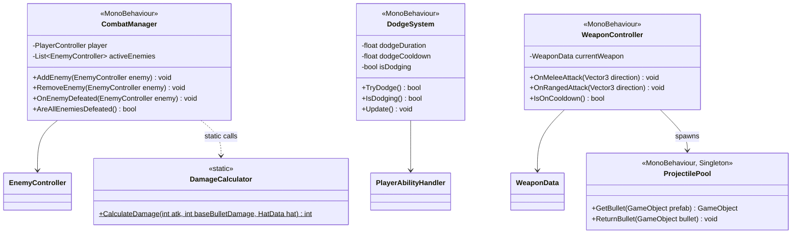

---

## Level & Progression System

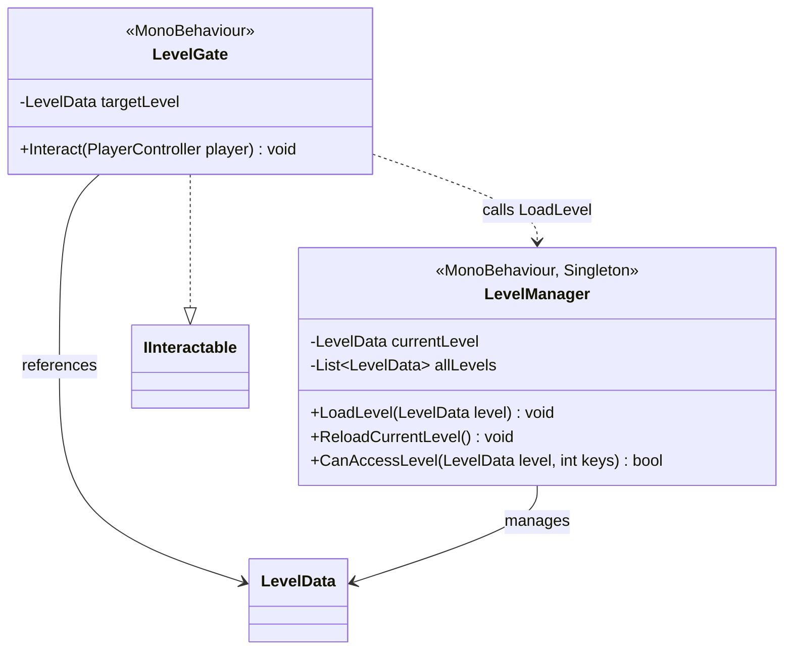

- Gates are placed manually in each level scene
- On level load: keys spent, scene loads async, ability unlocked, BGM changes
- On player death: `LevelManager.ReloadCurrentLevel()` — full scene reset

---

## Interactable & Puzzle System

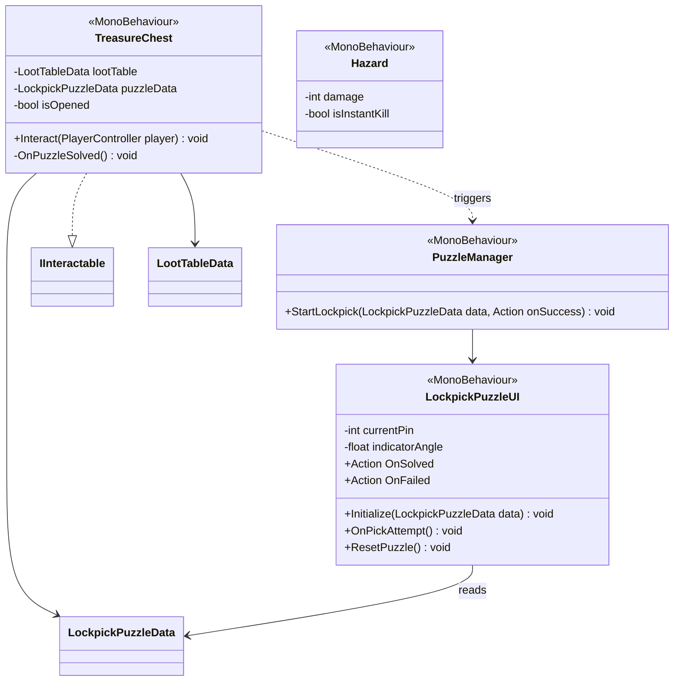

**Lockpick mechanic:** rotating indicator must land in a sweet spot for each pin. Miss any pin -> full reset. All pins cleared -> chest opens.

---

## UI System

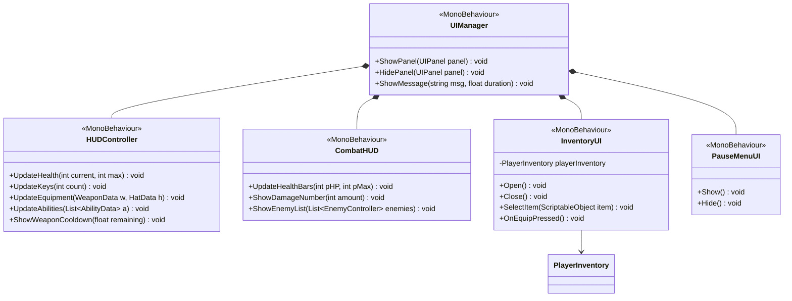

---

## Audio System

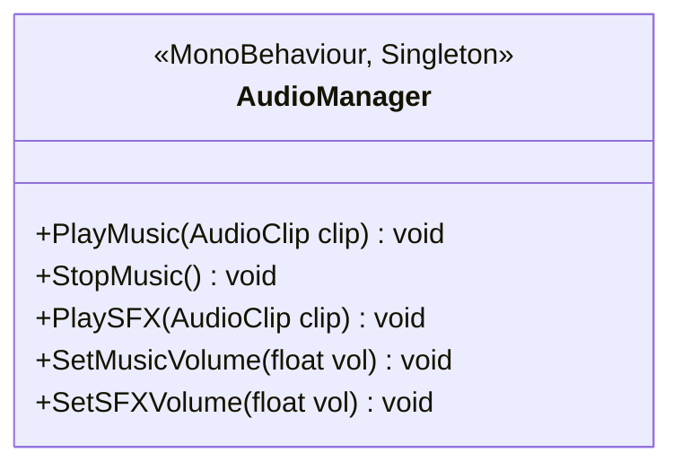

---

## GameManager

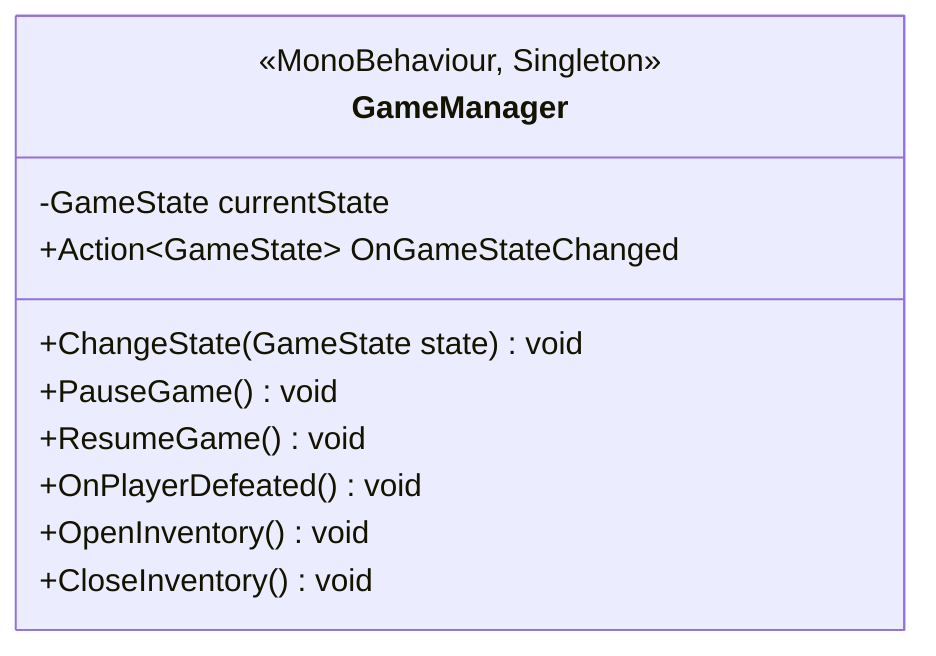

`GameManager.ChangeState()` is the single place that enables/disables player input and shows/hides the right UI panels.

---

## Full System Overview

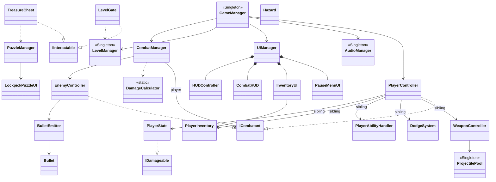
