# Technical Plan

Defines core classes, relationships, and responsibilities. 

---

## Enums & Interfaces

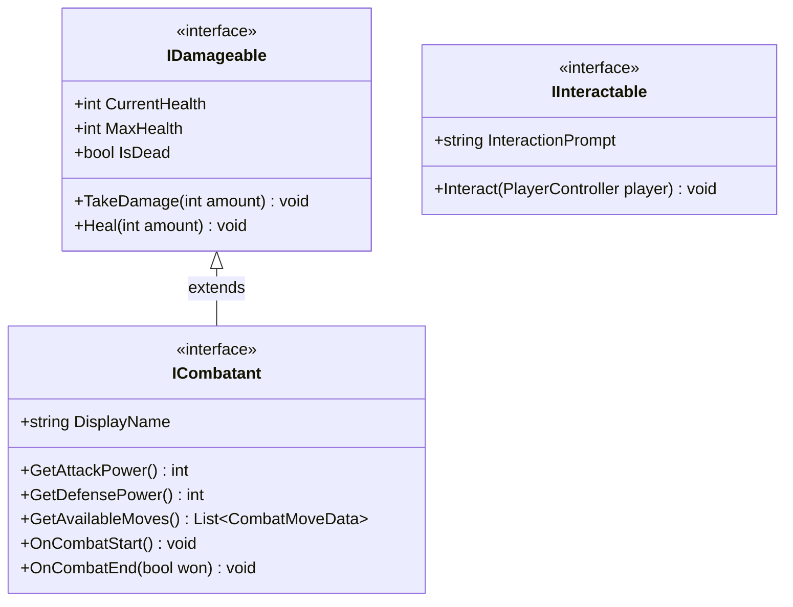

**Enums:**
```
GameState: Exploration, Combat, Puzzle, Inventory, Paused, Transition
MoveType: Attack, Heal, Buff, Debuff
MoveTarget: Self, Enemy
AbilityType: DoubleJump, DashStrike, Shield, Grapple, CombatMove
CombatPhase: PlayerSelectMove, PlayerExecute, EnemyWindup, PlayerParry: EnemyExecute, Victory, Defeat
ParryResult: Perfect, Partial, Miss
```

---

## ScriptableObject Data Layer

All game content is defined as ScriptableObject assets. Code never changes when adding new enemies, weapons, or levels.

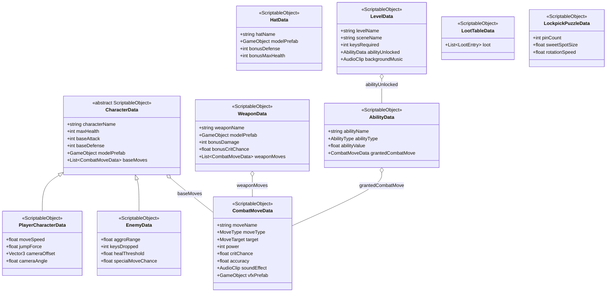

---

## Player System

Four sibling components on the Player GameObject. `PlayerController` is the hub and the others are focused helpers.

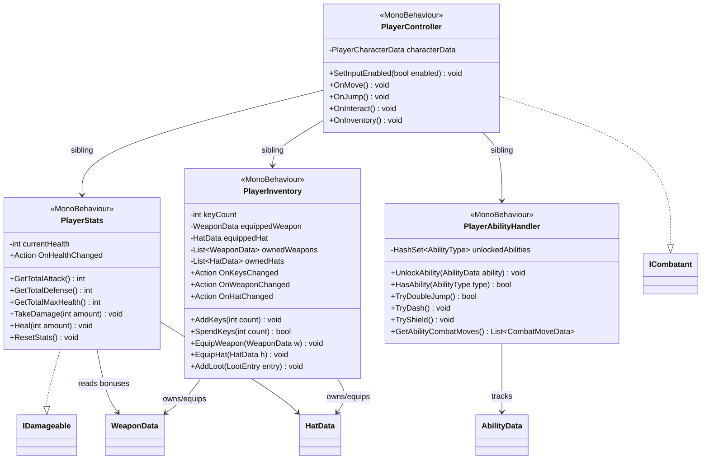

---

## Enemy System

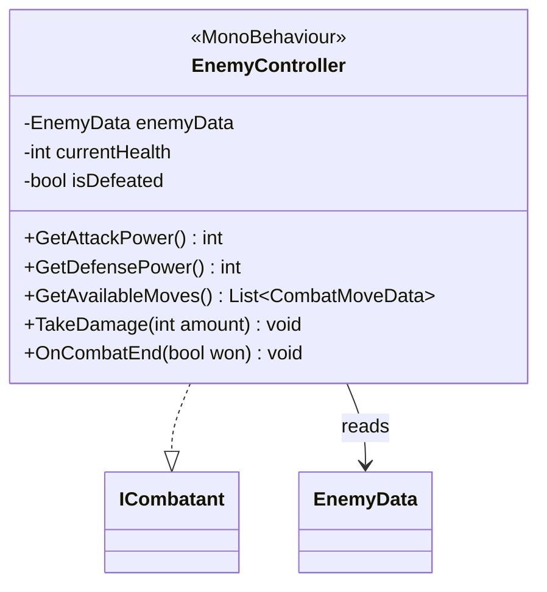

- One `EnemyController` prefab variant per enemy type
- Aggro detection (triggers combat) handled in `EnemyController` 
- On defeat: awards keys, plays death animation, disables self, etc.

---

## Combat System

Turn based 1v1. Operates on `ICombatant`.

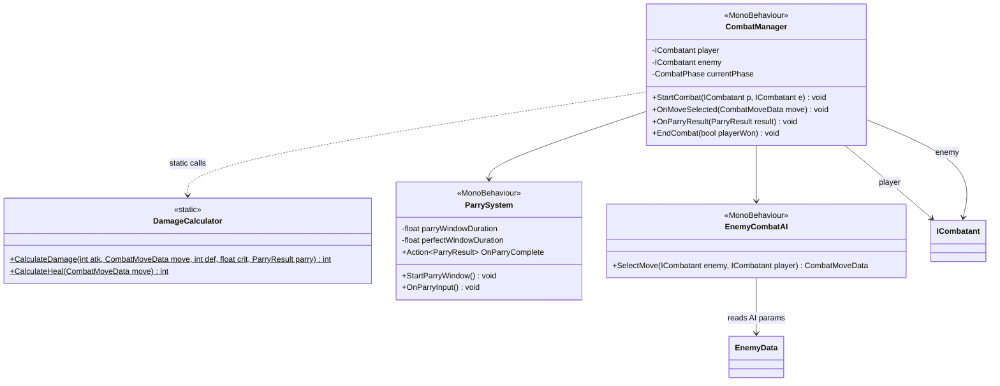

**Turn order:**

1. Player picks a move -> player executes
2. Enemy AI picks a move -> parry window opens → enemy executes
3. Repeat until one side is dead

---

## Level & Progression System

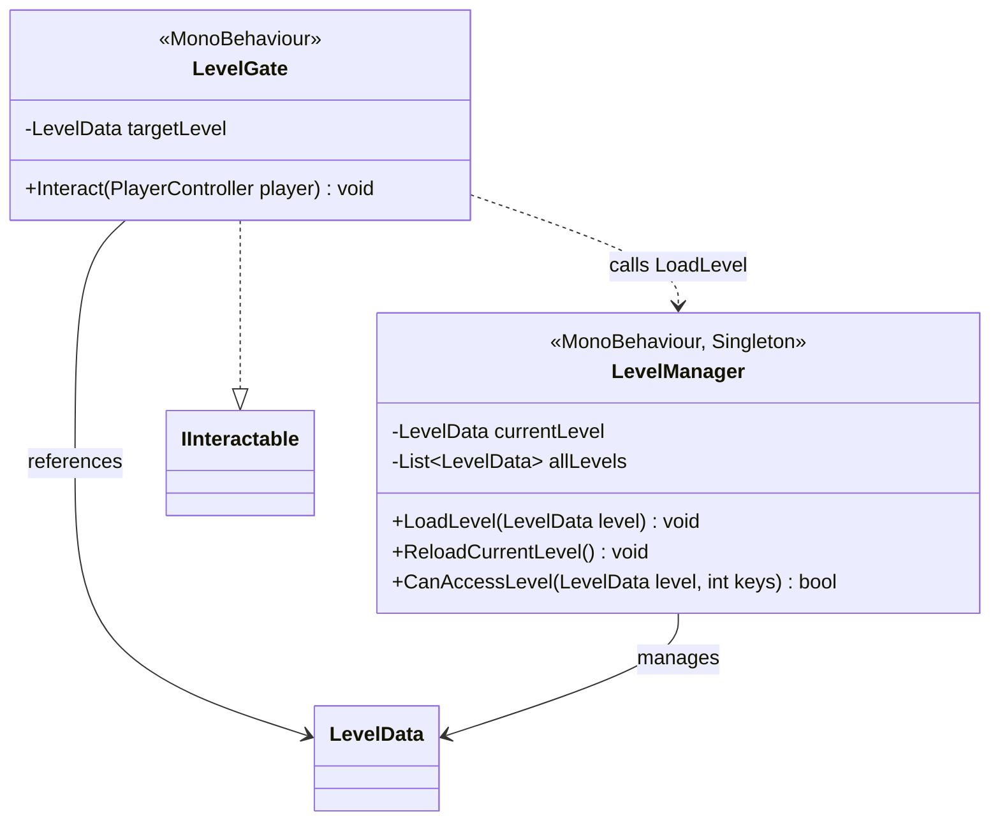

- Gates are placed manually in each level scene
- On level load: keys spent, scene loads async, ability unlocked, BGM changes
- On player death: `LevelManager.ReloadCurrentLevel()` — full scene reset

---

## Interactable & Puzzle System

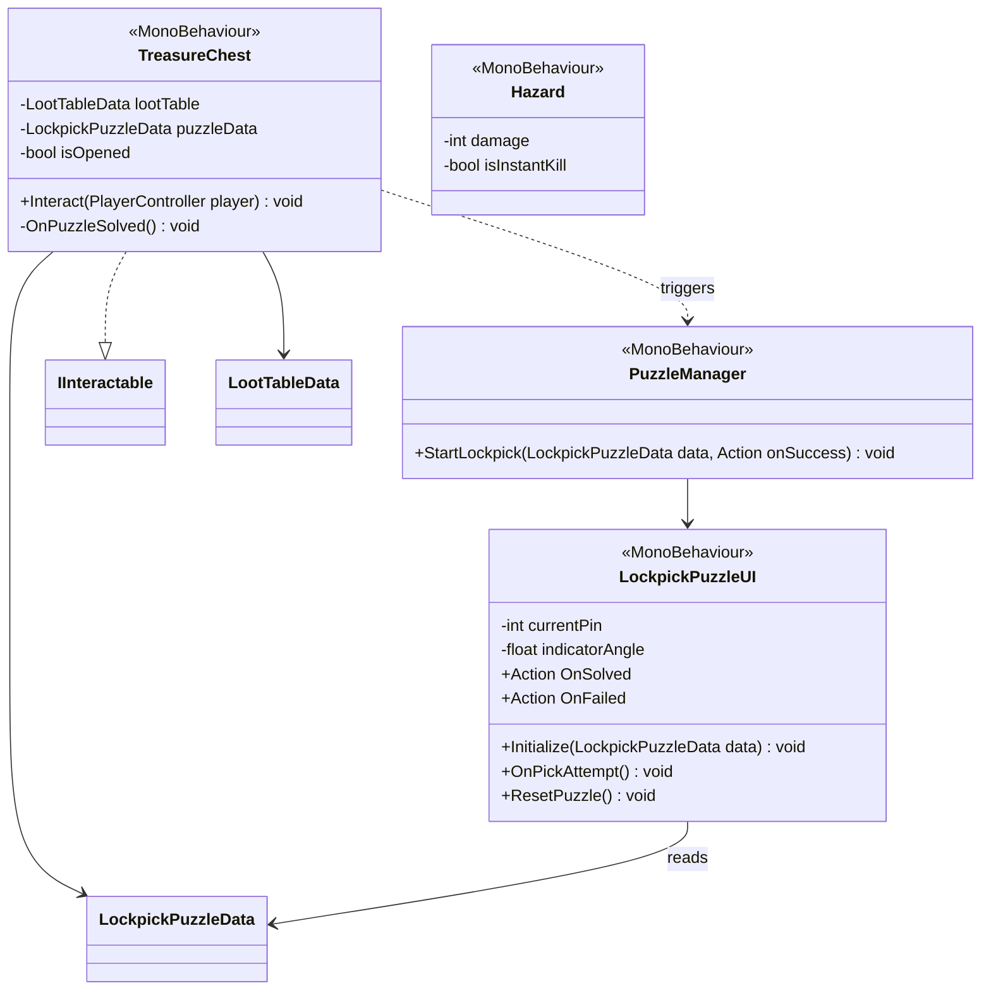

**Lockpick mechanic:** rotating indicator must land in a sweet spot for each pin. Miss any pin -> full reset. All pins cleared -> chest opens.

---

## UI System

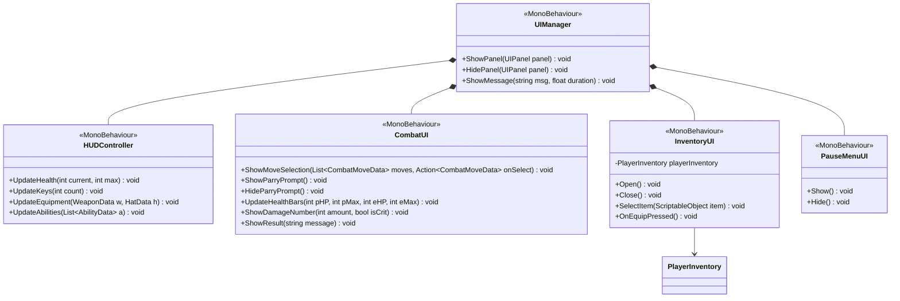

---

## Audio System

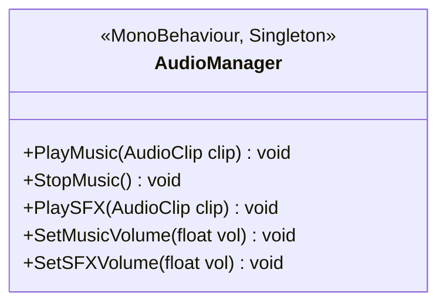

---

## GameManager

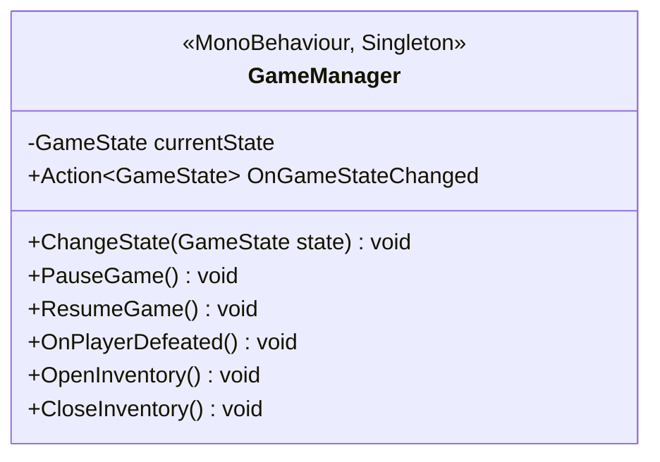

`GameManager.ChangeState()` is the single place that enables/disables player input and shows/hides the right UI panels.

---

## Full System Overview

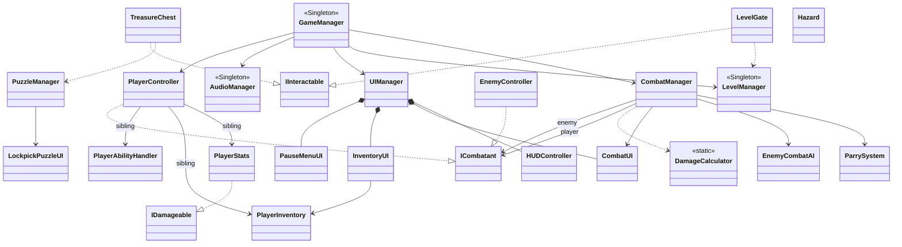
